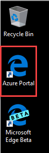
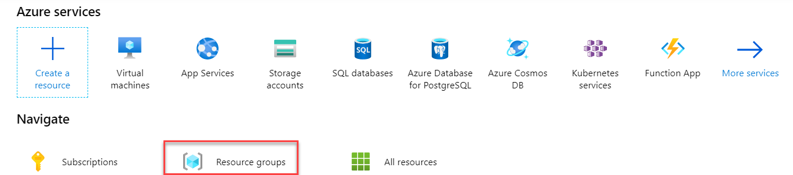
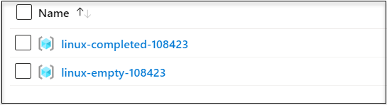

# Exercise 0: Login to your Azure Portal and Verify access to the Lab Resources

In this exercise, you will login to the **Azure portal** using your lab Azure credentials and you will verify access to lab resources.

### Login to Azure Portal 

1.Launch Azure Portal(https://portal.azure.com) in the desktop on left side. You can use the shortcut on the desktop. You'd be asked to choose default browser configurations, You can skip those for now by clicking cancel. 

   

2.Use **<inject key="AzureAdUserEmail"></inject>** as **Username** and click on **Next**.  Please use right click > **copy** to copy the username and paste inside the browser. You should allow **clipboard access** when asked by the browser. 

3.In next step, use **<inject key="AzureAdUserPassword"></inject>** as **Password**  and Click **Sign In**

4.On Stay signed in pop-up window, click **No**.

   
   
5.Click on **Resource Groups** to review the pre-created resource groups for you to use in the lab. 

   
   
6.You're provided with two pre-created **Resource Groups** in the Lab. Let's review them.

* linux-empty-UNIQUEID: Please use this resource group to deploy all resources as a part of this lab guide. This resource group does not contain any existing resources. 

* linux-completed-UNIQUEID: This resource group is having a pre-created Virtual Machine Scale Set. You can use this to perform lab exercise without provisioning a new VM Scale Set. 

  

   
7.Click **Next** on the bottom right of this page.

