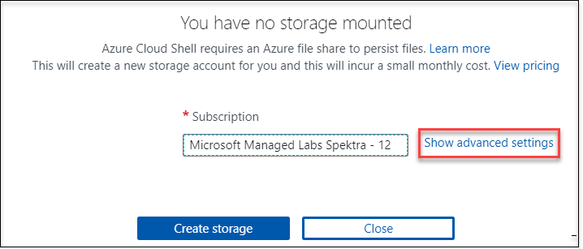
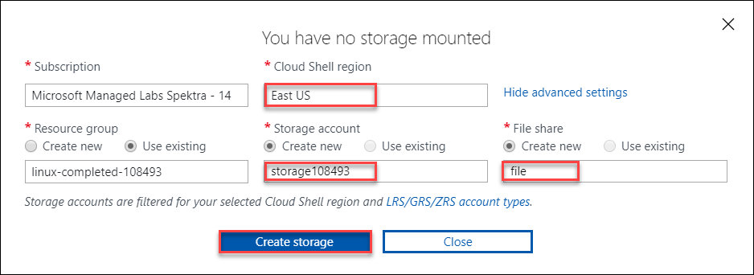
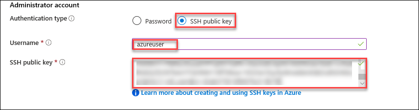
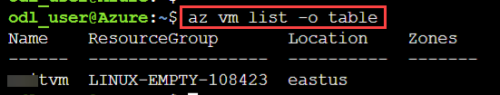
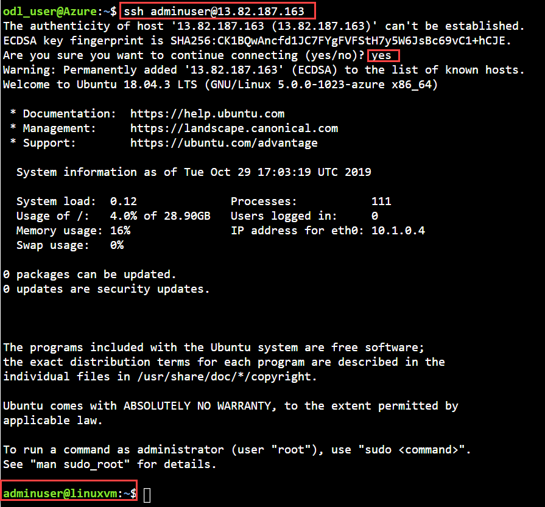
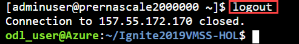
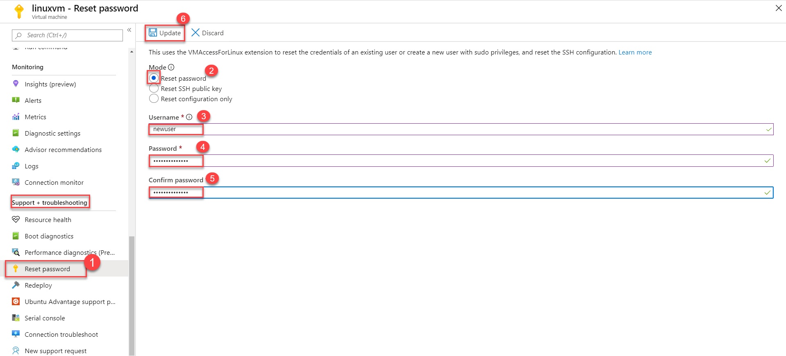
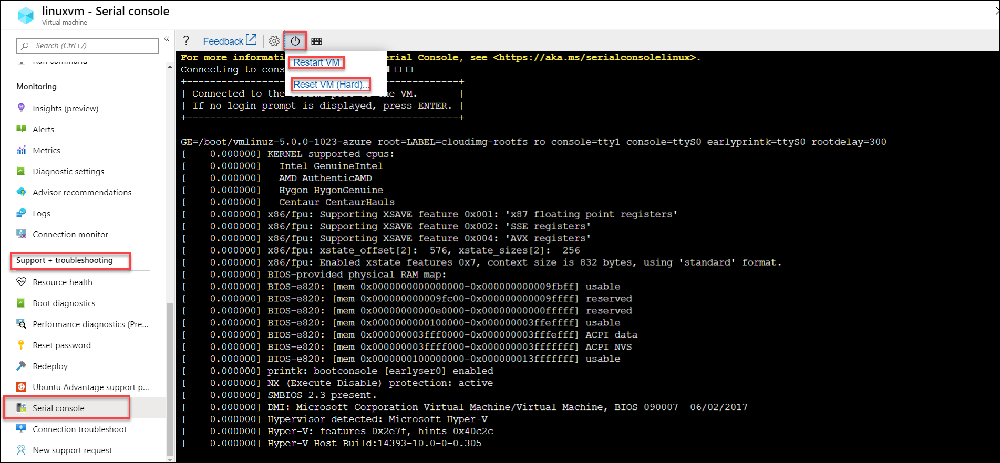

# Exercise 1: - Deploy an Azure Linux Virtual Machine using the Azure Portal 
Duration: 20 Minutes

### 1.1 Generate SSH Keys for Linux VM Authentication

In this exercise, We will be generating SSH Keys which will be used to authenticate with Linux Virtual Machines. 

1. Select  **Cloud Shell** from the upper right corner of the Azure Portal.

   
   
2. Select **Bash** in the cloud shell window.

3. Select **Show advanced settings**. 

   

4. In this step, you'll create a storage account for **Cloud Shell**.  Please provide a unique name for **Storage Account** and **File share**, select the **Cloud Shell region** as **East US** and then click on **Create Storage**. Please choose the existing resource group named **linux-empty-XXXX** by selecting **use existing** resource group button. 

   

5. Once your cloud shell is ready, run **ssh-keygen -t rsa -b 2048** command to generate the ssh key.

6. You will be prompted to enter a file name to save the key pair. Just press **Enter** to save with default settings i.e **/home/odl_user/.ssh/id_rsa**.

7. You will be asked to enter a passphrase to secure the ssh keys, Please press **Enter** twice to continue without a passphrase.

   

8. You will be using this public key while creating the virtual machines, run  **cat /home/odl_user/.ssh/id_rsa.pub** command to view your public key. Please copy the entire content of the public key and save in a notepad file to use later in this lab. 

### 1.2 Create the Ubuntu VM from Azure Portal
In this exercise, you will be creating an **Ubuntu** virtual machine using Azure Portal. Let's get started.

1. Click on the **Create a resource** in the upper left corner of the Azure portal and select the  **Ubuntu Server 18.04 LTS**.

   
   
2. In the basics tab under the **Virtual machine details**, make sure the existing **Subscription** and existing  **Resource group** named **linux-empty-XXXX** is selected

   
   
3. Under the **Instance details**, Enter the **Virtual machine name** of your choice, choose your **Region**, select **Ubuntu Server 18.04 LTS** image and select the virtual machine **size** as **Standard D2s v3**. Please note that all VM sizes are not allowed in the lab environment, Please ensure to choose the defined VM size only.
   
   
   
4. Under the **Administrator account** select the **SSH public key** for authentication type. Provide the **Username** of your choice and paste your **SSH public key** copied earlier from **cloud shell**.

   

5. Leave the remaining options default and select the **Review + create** button at the bottom of the page.

6. On the **Create a Virtual machine page**, you can review all configurations of the VM you are about to create. When you are ready, select **Create**.

   
   
7. It will take about 2 to 4 minutes for the VM to be deployed. Once deployed, you can review the Virtual machine details on the overview page. 

   
   
   
8. You have now successfully created a **Ubuntu Virtual Machine** on Azure. 

### 1.3 SSH to VM using Public IP

In this exercise, You'll be accessing the Ubuntu virtual machine deployed earlier through SSH. We will be using **Cloud Shell** for this.

1. Launch **Cloud Shell** if not running already and run following command to list down the VMs running in your lab environment.

       az vm list -o table       
   
   
   
2. Now, let's find out the public IP of your recently created Virtual Machine. Execute the following command in **cloud shell**, Please ensure to replace the resource group name **linux-empty-XXXX** and **VM name** with your lab environment values, you can review those from the output of last step.

       az vm show -d -g linux-empty-XXXX -n <VM name>  --query publicIps -o tsv

3. Run the following command to connect to your virtual machine remotely using SSH. 

   > x.x.x.x : Replace this with your virtual machine's **public IP address**

   > azureuser: Replace this with the username you entered while creating the virtual machine in the last exercise. 

       ssh azureuser@x.x.x.x
          
   
    
4. Type **yes** and hit enter when you're asked if you want to continue connecting to the virtual machine. 

5. You are now connected to your linux virtual machine through SSH. 
    
6. Run the following command to logout from your ubuntu virtual machine.

       logout

    

### 1.4 Reset Password of Virtual Machine
Azure allows you to reset the password or ssh key for virtual machines using the Azure portal. Let's take a look at how to reset password or sshkeys for your Linux virtual machines.  Please note that this step is optional. 

1. To reset the password or sshkey of the Ubuntu virtual machine, Navigate to the **Resource Groups > Your Resource Group > Your Virtual Machine > Overview > Support + Troubleshooting >Reset Password**.

   

### 1.5 Access Serial Console of Virtual Machine
The serial console in the Azure portal provides access to a text-based console for linux virtual machines (VMs) and virtual machine scale set instances. This serial connection connects to the ttys0 serial port of the VM or virtual machine scale set instance, providing access to it independent of the network or operating system state. Let's take a look at how to access your Linux VMs using **serial console**. 

1. To access the serial console of the Ubuntu virtual machine, Navigate to the **Resource Groups > Your Resource Group > Your Virtual Machine > Overview > Support + Troubleshooting > Serial Console**.

   

2. [Optional] You can also use the power button to **restart** or **reset** the virtual machine. This allows you to access the bootloader.

3. Click **Next** on the bottom right of this page to continue with the next lab exercise.
