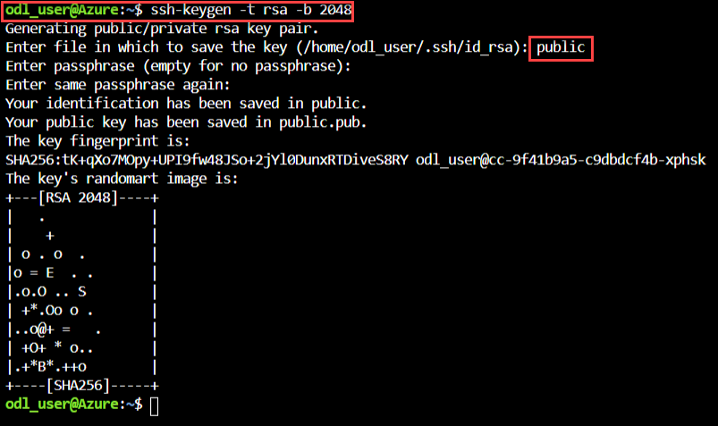

# Exercise 1: Create your first Linux VM (10 minutes) 
**1.1 SSH Key Genration** 
1. Select the **Cloud Shell** from the upper right corner of the Azure Portal. 
 
2. Select **BASH** in cloud shell window. 
3. Select **Show Advance Setting**. 
4. Create a storage accounr for Bash, provide unique name for **Storage Account**, **File share** and then click on **Create Storage**. 
 
5. Type **ssh-keygen -t rsa -b 2048** to create the ssh key. 
 
6. You will be prompted to enter a file in which to save the key pair. Just press Enter to save in the default location, listed in brackets. 
7. You will be asked to enter a passphrase. You can type a passphrase for your SSH key or press Enter to continue without a passphrase. 
8. To display public key run **cat /home/odl_user/public(your public key name)**. Copy the content of public key for further step. 

**1.2 Create Ubuntu VM from Azure Portal**  
1. Click on **Create a resource** in the upper left corner of the Azure portal and select **Ubuntu Server 18.04 LTS**. 
 
2. In the basics tab under **Project details**, make sure the correct **Subscription** is selected and then choose your **Resource  group**. 
 
3. Under **Instance details**, type **Virtual Machine Name** , choose your **Region**, select **Ubuntu Server 18.04 LTS or Ubuntu Server   16.04 LTS** image and select the virtual machine **size** from the following: 
``
"Standard_DS2_v2", "Standard_DS1_v2", "Standard_B1ls1", "Standard_B1s", "Standard_B1ms", "Standard_B2s", "Standard_B2ms", "Standard_B4ms", "Standard_B8ms", "Standard_E16-4s_v3", "Standard_E2s_v3", "Standard_E4-2s_v3", "Standard_E4s_v3", "Standard_E8-2s_v3", "Standard_E8-4s_v3", "E16-4s_v3", "E16-8s_v3".
``
 
4. Under **Administrator account** select **SSH Public Key** for authentication type. Provide **User Name** and paste your **Public key**. 
 
5. Under **Inbound port** rules > Public inbound ports, choose **Allow selected ports** and then select **SSH (22)** from the drop-down. 
 
6. Leave the remaining options defaults and then select the **Review + create** button at the bottom of the page. 
7. On the Create a **Virtual Machine Page**, you can see the details about the VM you are about to create. When you are ready, select **Create**. 
       
8. After sometime you can see that your virtual machine successfully deployed. 
 
### 1.3 SSH to VM using Public IP 
1. To display you virtual machine **Public IP** run below command. 
``az vm show -d -g ODL-linux-XXXX -n <VM name>  --query publicIps -o tsv
``
2. Run below command to take **SSH** of your virtual machine. 
* x.x.x.x :- Replace this with your virtual machine **Public IP**. 
``ssh -i <private key name> azureuser@x.x.x.x -p 22
``
 
3. Run this command to logout from ubuntu machine 
``logout
`` 

### 1.4 Reset Password of Virtual Machine 
1. For using reset password of Ubuntu virtual machine navigate to the **Resource Group->Virtual Machine->Overview->Support + Troubleshooting->Reset Password**. 
 
### 1.5 Access Serial Console of Virtual Machine 
1. For using serial console of Ubuntu virtual machine navigate to the **Resource Group->Virtual Machine->Overview->Support + Troubleshooting->Serial Console**. 
 
2. Select power botton to **Restrat** or **Rest** the virtual machine.
