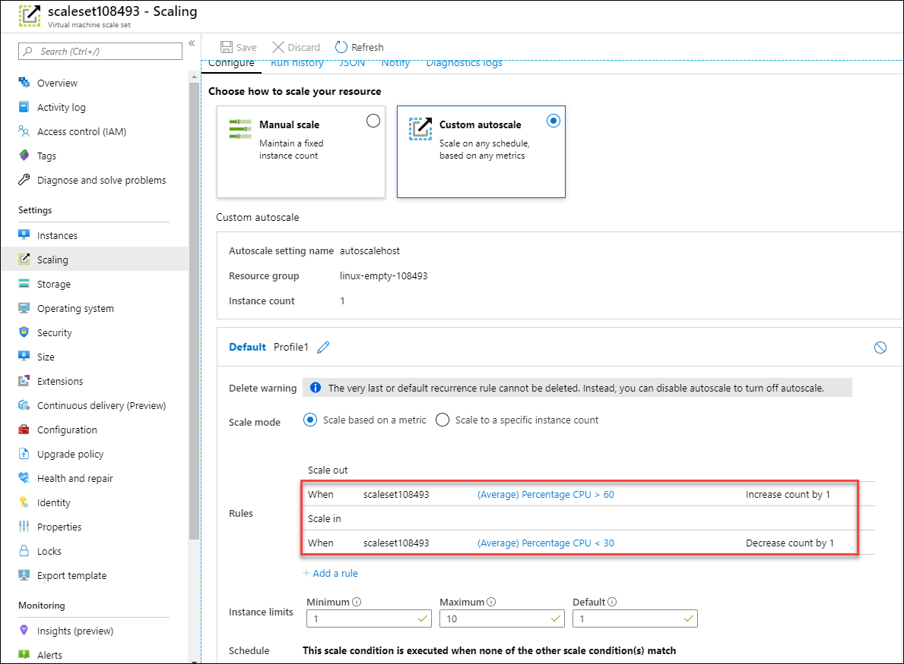
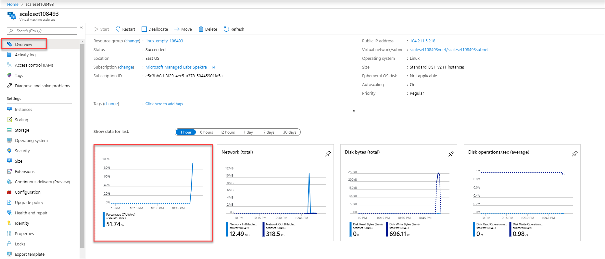
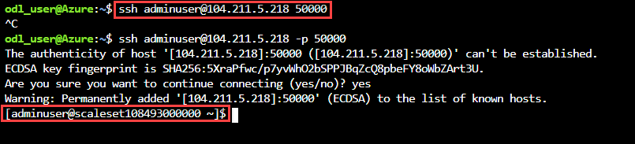
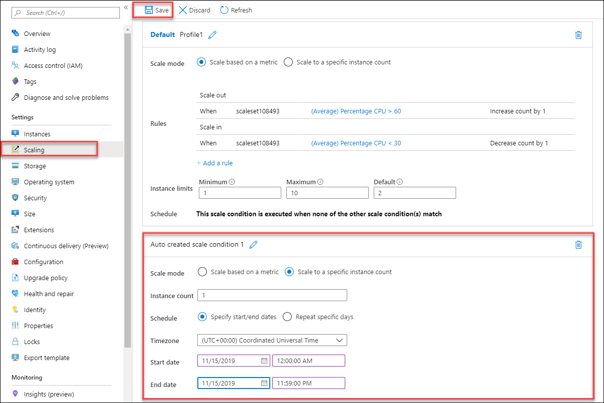

# Exercise 2: Deploy VM Scale Set (15 minutes)

A VM scale set (VMSS) is a way to deploy several similar VMs with a single command – you can use a scale set to deploy between 0 to 1000 VMs. Scale sets have built-in high availability and integrate with Azure auto-scale. In last exercise, we used the **Azure Portal** to create a VM, so let's use the Azure CLI and ARM Template to deploy a VMSS and an app to it. 

### 2.1 Create a Scale Set
In this exercise, You'll be creating a **Virtual Machine Scale Set** using azure cli command line and ARM templates. Let's get started.

1.Select the **Cloud Shell** icon from the upper right corner of the Azure Portal.

   
   
2.Select **Bash** once prompted to start the **Cloud Shell**.

3.Clone this repo: https://github.com/asinn826/Ignite2019VMSS-HOL to your **Cloud Shell** by running following command:

       git clone https://github.com/asinn826/Ignite2019VMSS-HOL

   
   
4.Run following command to change the present directory to newly cloned repository. Run **ls** to review the content of the repository. 
  
       cd Ignite2019VMSS-HOL
       
   
   
5.This repository contains the ARM template & Parameter file which will provision a Virtual Machine Scale set and deploy application on it. You can review by template files by browsing https://github.com/asinn826/Ignite2019VMSS-HOL in a seprate browser tab. 
   
6.Now, You'll need to edit the **azuredeploy.parameters.json** to provide your deployment specific values. Run the following command to open the parameters file in Visual Studio code. Please ensure to modify the **vmssName** and **adminSshKey** values in the parameters file. 
      
       code azuredeploy.parameters.json
       
   > vmssName: Give a unique name for your VM scale set.
   
   > adminSshKey: Paste your **Public key** created earlier. 

   
   
7.Save and Close the Code Editor once completed. 

8.Now, let's create the deployment by running below command. Please ensure to use your existing **Resource group** named **linux-empty-XXXX** and wait for the deployment to finish. 

   ``az group deployment create -g linux-empty-XXXX --template-file azuredeploy.json --parameters azuredeploy.parameters.json 
   ``

   
   
**What did you just do**

It'll take 5 to 7 minutes for the deployment to complete. Meanwhile, Let us review what did we just do. 

   * The files azuredeploy.json and azuredeploy.parameters.json are most relevant here.

   * The command above just deployed a virtual machine scale set (https://docs.microsoft.com/en-us/azure/virtual-machine-scale-sets/overview).

   * VM scale sets are great for scaling out applications – for example, if you are running a workload and you anticipate a spike in holiday-related traffic, the VMSS can scale-out automatically to meet your compute needs, and scale back in when traffic subsides.
   
   * The template deployed the VMSS using a Red Hat Enterprise Linux (RHEL) image, one of the many available images in the Azure Marketplace.
   
   * The template also used cloud-init to deploy a simple web application onto the VM. The cloud-init script runs once, at the beginning of the deployment, to configure the VM to its desired end state.
   
   * Note about cloud-init: the RHEL image we chose has cloud-init enabled, which means that cloud-init is the provisioning agent.
      - We are bringing cloud-init to Azure VM images, so this will slowly become the default option.
      - If you are familiar with cloud-init from other environments, this will function exactly the same.
      - Ask the lab proctors for more details if you’re curious.
      

### 2.2 Familiarizing yourself with your VM scale set (5 minutes)

1.In the Azure portal, navigate to your **Resource Group**, and click on your newly-created **Virtual Machine Scale Set**.

2.Go to the **Instances**. Note that you only have one instance, as per the instance count defined in ARM Template.

   
   
3.Go to the individual instance. Here you can view details for your individual VMSS instance - you can restart, deallocate, reimage, or upgrade the instance.

**Note: What is upgrading?**

   * VM scale sets work on a model basis - there is a model that the scale set follows, and all VMs within the scale set has the same configuration as defined in the model.

   * If the model changes, you will need to upgrade the instance(s) to the latest model - hence the Upgrade button in the UI (you can also configure scale sets to automatically upgrade when the model changes).

   * If you have more questions, ask a proctor.

   * In the instance view, you can also access features like Azure Bastion, Serial console, and Boot diagnostics.

   * Note that none of these were configured initially in your VM scale set, so you will need to upgrade the scale set model and then update individual instances to use them.

   * There is a bonus section to this lab where you can try this for yourself.
 
 In the instance view, you can also access features like Azure Bastion, Serial console, and Boot diagnostics
 
   * Note that none of these were configured initially in your VM scale set, so you will need to upgrade the scale set model and then update individual instances to use them
   * There is a bonus section to this lab where you can try this for yourself

### 2.4 Use autoscale rules on your VM scale set (25 minutes)
An Azure virtual machine scale set can automatically increase or decrease the number of VM instances that run your application.You create rules that define the acceptable performance for a positive customer experience. When those defined thresholds are met, autoscale rules take action to adjust the capacity of your scale set. You can also schedule events to automatically increase or decrease the capacity of your scale set at fixed times. Let us review the auto-scale settings for your VMSS.

1.Go to the **Scaling** in the VMSS. Currently, the VMSS is set to automatic scaling.

2.The VMSS will scale automatically based on load  measured by CPU Utilization % of the VMSS Instances. Currently it's set increase the VMSS by 1 instance if the CPU utilization goes beyond 60% and decrease by 1 instance if CPU utilization goes lower than 60%. Additionally, there're minimum and maximum number of instances defined.  

   

### 2.5 Autoscale via the deployed web application
In this exercise, We'll try to generate load on our newly create application hosted on VMSS. Let's get started

1.Go back to the **Overview** section for your scale set.

2.Copy the **Public IP address**, and navigate to **publicIpaddress:9000** in your browser. Please ensure to add port 9000 along with Public IP.  You will see a landing page that looks like:
   
   
   
3.To view the autoscale in action, simply click the **Start work** on the page.

4.Then, go back to the VM scale set in the Azure portal and watch its CPU rise once CPU Utlization is higher than 60%, a new scale set instance will automatically be created.

   
   
5.Go to the **Instances** and watch VM getting created.

6.You can also **SSH** into your individual instance by running below command in the Cloud Shell:-
  
       ssh adminusername@<ip-address -p 50000
 
   

### 2.6 Autoscale manually in the Azure Portal based on date/time

1.In the **Azure Portal** and go to the **Scaling**, and let's try out creating a scheduled autoscale rule (https://docs.microsoft.com/en-us/azure/virtual-machine-scale-sets/virtual-machine-scale-sets-autoscale-overview#scheduled-autoscale)

2.Click the **Custom Autoscale**, and note all the options you have.

   
   
3.Leave the auto-created scale condition with the **Default Settings**.

4.Click on the **Add a scale set condition**.

   - Select the **Scale to a specific instance count**.
   - Set Instance count to a **2**.
   - Select the **Specify start/end dates**.
   - **Timezone**: (UTC-05:00) Eastern Time (US & Canada).
   - **Start date**: Enter time of 2 minutes from now to test the scheduler.
   - **End date**: Enter time of 10 minutes from now to test the scheduler.

     

### 2.7 Additional Autoscale documentation and information

  * See the docs here for more info on autoscale rules:
     - https://docs.microsoft.com/en-us/azure/virtual-machine-scale-sets/virtual-machine-scale-sets-autoscale-overview 
     - https://docs.microsoft.com/en-us/azure/virtual-machine-scale-sets/virtual-machine-scale-sets-autoscale-portal
  * The following examples are scenarios that may benefit the use of schedule-based autoscale rules:

Automatically scale out the number of VM instances at the start of the workday when customer demand increases. At the end of the workday, automatically scale in the number of VM instances to minimize resource costs overnight when application use is low.
  * If a department uses an application heavily at certain parts of the month or fiscal cycle, automatically scale the number of VM instances to accommodate their additional demands.
  * When there is a marketing event, promotion, or holiday sale, you can automatically scale the number of VM instances ahead of anticipated customer demand.
  * The following scenarios may benefit from load-based autoscale:
     - Elastic loads with no set schedule – DevOps builds for an organization, a web server that can receive traffic from anywhere at any time
   
    > Note: You can combine multiple scale-out and scale-in conditions.

### 2.8 Bonus section (optional): configure your VMSS for serial console (10-15 extra minutes)

1.To add a password to your VMSS go to the **Reset Password**.

2.Enter the **Username** and **Password**.

   
   
3.Open up the **Serial Console** in your VMSS instance and get the boot diagnostics error.

   
   
4.Update the VMSS model to enable **Boot Diagnostics**, then **Save**.

   

#### This concludes the lab. 
